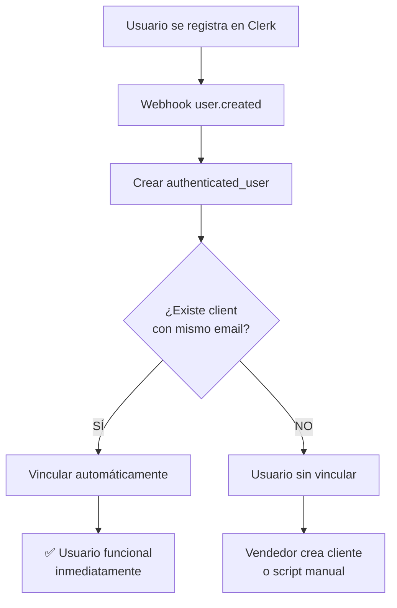

# ✅ Auto-Vinculación de Usuarios - Implementado

## 🎯 Funcionalidad Agregada

### **Vinculación Automática por Email en Webhook de Clerk**

Cuando un usuario se registra en la aplicación, el sistema ahora:

1. ✅ **Crea el `authenticated_user`** con los datos de Clerk
2. 🔍 **Busca automáticamente** un `client` con el mismo email
3. 🔗 **Vincula automáticamente** si encuentra coincidencia
4. ✅ **Usuario puede operar inmediatamente** sin pasos manuales

---

## 📝 Código Implementado

### Archivo: `app/api/webhooks/clerk/route.tsx`

```typescript
// Evento: user.created
if (eventType === 'user.created') {
  // 1. Crear authenticated_user
  const newUser = await prisma.authenticated_users.create({
    data: {
      authId: id,
      email: userEmail,
      name,
      role: role as any,
    }
  })
  
  // 2. 🔗 BUSCAR cliente existente con mismo email
  const existingClient = await prisma.client.findFirst({
    where: { email: userEmail },
    include: { seller: true }
  })
  
  // 3. ✅ VINCULAR si existe
  if (existingClient) {
    await prisma.client.update({
      where: { id: existingClient.id },
      data: {
        authenticated_users: {
          connect: { id: newUser.id }
        }
      }
    })
    
    console.log('✅ Usuario vinculado automáticamente con cliente existente')
    console.log(`   → Puede ver catálogo del seller: ${existingClient.seller?.name}`)
  }
}

// Evento: user.updated (misma lógica)
```

---

## 🎬 Casos de Uso

### ✅ Caso 1: Vendedor crea cliente, luego cliente se registra

```
1. Vendedor Juan crea cliente:
   - Email: "restaurant@abc.com"
   - sellerId: juan_seller_123
   
2. Cliente se registra en Clerk con "restaurant@abc.com"
   
3. 🔗 Webhook detecta coincidencia y vincula
   
4. ✅ Cliente puede:
   - Iniciar sesión inmediatamente
   - Ver productos de Juan
   - Hacer órdenes
   - Ver historial (si existe)
```

### ✅ Caso 2: Usuario nuevo sin cliente previo

```
1. Usuario se registra con "nuevo@ejemplo.com"
   
2. 🔍 Webhook busca cliente con ese email
   
3. ❌ No encuentra nada
   
4. Usuario creado pero:
   - No puede acceder a /buyer/*
   - Necesita que seller lo agregue como cliente
   - Después puede usar register-as-client.js
```

---

## 📊 Flujo Completo



---

## 🔍 Logs de Consola

Cuando hay vinculación exitosa:

```
📩 Webhook recibido: user.created
✅ Usuario creado: restaurant@abc.com (CLIENT)
🔍 Cliente encontrado con email restaurant@abc.com:
   • Client ID: abc-123-def
   • Nombre: Restaurant ABC
   • Seller: Juan Seller
✅ Usuario vinculado automáticamente con cliente existente
   → El usuario ahora puede autenticarse y ver el catálogo del seller
```

Cuando NO hay cliente:

```
📩 Webhook recibido: user.created
✅ Usuario creado: nuevo@ejemplo.com (CLIENT)
ℹ️ No se encontró cliente con email nuevo@ejemplo.com
   → Usuario creado sin vincular a cliente (puede registrarse después)
```

---

## ⚡ Beneficios

### Para el Vendedor:
- ✅ Crea clientes con emails desde la UI
- ✅ Clientes pueden auto-registrarse después
- ✅ Cero configuración manual adicional
- ✅ Flujo transparente y automático

### Para el Cliente:
- ✅ Registro simple en Clerk
- ✅ Acceso inmediato si fue pre-registrado
- ✅ Ve su seller y productos asignados
- ✅ Puede hacer órdenes de inmediato

### Para el Sistema:
- ✅ Menor fricción en onboarding
- ✅ Menos errores manuales
- ✅ Mejor experiencia de usuario
- ✅ Automatización completa

---

## 🧪 Testing

### Para probar la funcionalidad:

**1. Crear cliente como vendedor:**
```
POST /api/clients
{
  "name": "Test Restaurant",
  "email": "test@restaurant.com",
  "phone": "555-0001",
  "address": "123 Test St"
}
```

**2. Registrar usuario en Clerk:**
- Ir a: https://food-order-crm.vercel.app/sign-up
- Usar email: "test@restaurant.com"
- Completar registro

**3. Verificar en logs de Vercel:**
- Buscar: "Usuario vinculado automáticamente"
- Confirmar sellerId asignado

**4. Probar login:**
- Login con "test@restaurant.com"
- Acceder a /buyer/catalog
- ✅ Debe ver productos del seller

---

## 📁 Archivos Modificados

```
app/api/webhooks/clerk/route.tsx
  ↓
  • Línea ~90: Agregada búsqueda de cliente por email
  • Línea ~102: Agregada vinculación automática
  • Línea ~115: Logs descriptivos
  
  • Línea ~145: Misma lógica en user.updated
```

---

## 🔄 Commit Info

```bash
Commit: 7b68c49
Mensaje: "feat(webhook): auto-link users to existing clients by email"
Branch: main
Estado: ✅ En GitHub (Vercel límite alcanzado)

# Para desplegar manualmente más tarde:
vercel --prod --archive=tgz
```

---

## 🚀 Próximos Pasos Sugeridos

1. **Notificación al vendedor** cuando cliente se auto-registra
2. **Email de bienvenida** al cliente vinculado
3. **Dashboard de clientes pendientes** de vinculación
4. **Soporte para múltiples sellers** por cliente
5. **Logs de auditoría** de vinculaciones automáticas

---

## ❓ FAQ

### ¿Qué pasa si el email no coincide exactamente?
- No se vincula automáticamente
- Usuario debe contactar soporte o vendedor
- Vendedor puede actualizar email del cliente

### ¿Se puede vincular a múltiples sellers?
- ❌ No actualmente (limitación del schema)
- Cliente solo puede tener UN sellerId
- Para cambiar: necesita migración de schema

### ¿Qué pasa con los usuarios existentes?
- Esta funcionalidad solo aplica a nuevos registros
- Usuarios existentes: usar scripts manuales
- O actualizar perfil para trigger evento updated

### ¿Es reversible?
- Sí, se puede desvincular manualmente en BD
- O eliminando relación en tabla intermedia
- Código no tiene lógica de desvinculación automática

---

## ✅ Checklist de Verificación

- [x] Código implementado en webhook user.created
- [x] Código implementado en webhook user.updated  
- [x] Logs descriptivos agregados
- [x] Build exitoso (npm run build)
- [x] Commit realizado
- [x] Push a GitHub completado
- [ ] Deploy a Vercel (pendiente - límite alcanzado)
- [x] Documentación actualizada (CONEXION_VENDEDOR_COMPRADOR.md)
- [x] Resumen de implementación creado

---

## 📞 Soporte

Si encuentras problemas:

1. Revisar logs de Vercel: `/api/webhooks/clerk`
2. Verificar que CLERK_WEBHOOK_SECRET esté configurado
3. Confirmar que emails coinciden exactamente
4. Verificar que cliente tenga sellerId asignado
5. Usar endpoint debug: GET /api/debug/my-info
