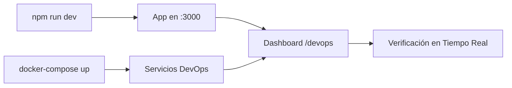
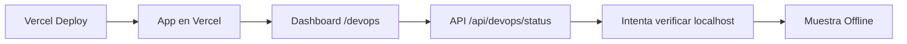

# 🚀 Dashboard DevOps - Monitoreo en Tiempo Real

## ✨ Descripción

Dashboard profesional de monitoreo DevOps con verificación de estado en tiempo real, diseñado para funcionar tanto en desarrollo local como en producción con Vercel.

## 🎯 Características

### 🔍 Monitoreo en Tiempo Real
- ✅ Verificación automática del estado de servicios
- ✅ Indicadores de estado (Online/Offline) con tiempo de respuesta
- ✅ Auto-refresh cada 10 segundos (activable)
- ✅ Resumen de uptime y estadísticas
- ✅ Última verificación con timestamp

### 📊 Servicios Monitoreados

#### Core Services
- **Aplicación** (`:3000`) - Next.js App con Clerk Auth
- **Adminer** (`:8080`) - Database Management UI

#### Monitoring
- **Grafana** (`:3001`) - Dashboards y Métricas
- **Prometheus** (`:9090`) - Sistema de Monitoreo
- **Alertmanager** (`:9093`) - Gestión de Alertas
- **cAdvisor** (`:8081`) - Container Monitoring

#### CI/CD
- **Jenkins** (`:8082`) - CI/CD Automation
- **SonarQube** (`:9000`) - Análisis de Código

### 🎨 Interfaz

#### Panel de Resumen
- Total de servicios
- Servicios online
- Servicios offline
- Porcentaje de uptime

#### Tarjetas de Servicios
- Icono identificativo
- Nombre y puerto
- Descripción del servicio
- Badge de estado en tiempo real
- Tiempo de respuesta (ms)
- Credenciales cuando aplica
- Botones de acceso directo
- Copia URL al portapapeles

#### Comandos Rápidos
- `npm run dev` - Iniciar desarrollo
- `npm run docker:dev` - Iniciar Docker services
- `docker-compose --profile monitoring up -d` - Iniciar monitoreo
- `docker-compose --profile ci up -d` - Iniciar CI/CD
- `docker-compose ps` - Ver estado
- `npm run prisma:studio` - Abrir Prisma Studio

#### Acciones Rápidas
- 📱 Iniciar Dev
- 🐳 Iniciar Docker
- 📊 Ver Estado
- 🗄️ Prisma Studio

## 🌐 Acceso

### En Desarrollo Local
```bash
npm run dev
```
Abrir: http://localhost:3000/devops

### En Vercel (Producción)
```bash
vercel --prod
```
URL: https://tu-proyecto.vercel.app/devops

## 🔧 API Endpoints

### GET `/api/devops/status`

Verifica el estado de todos los servicios DevOps.

**Respuesta:**
```json
{
  "summary": {
    "total": 8,
    "online": 5,
    "offline": 3,
    "lastCheck": "2026-01-06T12:00:00.000Z"
  },
  "services": [
    {
      "name": "Aplicación",
      "url": "http://localhost:3000",
      "status": "online",
      "responseTime": 45,
      "port": 3000,
      "category": "core"
    }
  ]
}
```

**Lógica de Verificación:**
- Timeout de 2 segundos por servicio
- Status 200 o 401 = Online (401 significa servicio activo pero requiere auth)
- Otros status o error = Offline
- Medición de tiempo de respuesta en ms

## 🎛️ Uso

### Verificación Manual
1. Click en botón "🔄 Verificar Estado"
2. Espera la verificación de todos los servicios
3. Revisa los badges de estado actualizados

### Auto-Refresh
1. Click en "▶️ Auto-refresh OFF"
2. El sistema verifica cada 10 segundos
3. El botón cambia a "⏸️ Auto-refresh ON" (verde)
4. Click nuevamente para desactivar

### Acceso a Servicios
1. Click en "Abrir [Servicio]" para acceder directamente
2. O click en "📋 Copiar URL" para copiar al portapapeles
3. Las credenciales se muestran cuando aplica

### Comandos
1. Click en cualquier comando para copiarlo
2. El icono cambia a ✓ cuando se copia
3. Pega en tu terminal y ejecuta

## 📱 Diseño Responsive

- **Desktop:** Grid de 3 columnas
- **Tablet:** Grid de 2 columnas
- **Mobile:** Grid de 1 columna
- Todas las funcionalidades disponibles en todos los dispositivos

## 🎨 Temas Visuales

### Colores por Categoría
- **Core:** Azul (`from-blue-500 to-blue-600`)
- **Monitoring:** Naranja (`from-orange-500 to-orange-600`)
- **CI/CD:** Morado (`from-purple-500 to-purple-600`)

### Estados
- **Online:** Verde con punto pulsante
- **Offline:** Rojo con punto sólido
- **Checking:** Gris con animación de pulso

## 🚀 Deployment en Vercel

### Método 1: GitHub Actions (Automático)
Ya configurado en `.github/workflows/vercel-deploy.yml`:
- Pull requests → Preview deploy
- Branch `develop` → Staging deploy
- Branch `main` → Production deploy (con aprobación manual)

### Método 2: Vercel CLI (Manual)
```bash
# Instalar Vercel CLI
npm i -g vercel

# Deploy a producción
vercel --prod

# O solo staging
vercel
```

### Variables de Entorno Requeridas
```env
# Clerk (Authentication)
NEXT_PUBLIC_CLERK_PUBLISHABLE_KEY=pk_***
CLERK_SECRET_KEY=sk_***

# Database
DATABASE_URL=postgresql://***

# Redis (opcional)
REDIS_URL=redis://***
```

## 🔒 Seguridad

### En Desarrollo
- Servicios corren en localhost
- Sin acceso público
- Credenciales por defecto para desarrollo

### En Producción (Vercel)
- Dashboard funciona en Vercel
- API de status accesible públicamente
- Servicios reales (Jenkins, Grafana, etc.) **NO** están en Vercel
- Los servicios deben correr en infraestructura separada
- Mostrar estado "Offline" es esperado en producción

## 📊 Flujo de Trabajo

### Desarrollo Local


### Producción Vercel


## 🛠️ Personalización

### Agregar Nuevo Servicio
1. Editar `app/devops/page.tsx`:
```typescript
const services: Service[] = [
  // ... servicios existentes
  {
    name: 'Nuevo Servicio',
    url: 'http://localhost:8888',
    description: 'Descripción del servicio',
    icon: '🆕',
    credentials: 'user / pass',
    category: 'monitoring', // o 'core' o 'cicd'
    port: 8888,
  },
];
```

2. El servicio aparecerá automáticamente en:
   - Dashboard visual
   - Verificación de estado
   - API `/api/devops/status`

### Cambiar Intervalo de Auto-Refresh
Editar línea 162 de `app/devops/page.tsx`:
```typescript
const interval = setInterval(checkAllServices, 10000); // 10 segundos
```

### Cambiar Timeout de Verificación
Editar línea 8 de `app/api/devops/status/route.ts`:
```typescript
async function checkService(url: string, timeout = 2000) // 2 segundos
```

## 📈 Métricas y Monitoreo

### Dashboard Muestra
- ✅ Número total de servicios
- ✅ Servicios activos (online)
- ✅ Servicios inactivos (offline)
- ✅ Porcentaje de uptime
- ✅ Tiempo de respuesta de cada servicio
- ✅ Timestamp de última verificación

### Casos de Uso
1. **Desarrollo:** Verificar que todos los servicios estén corriendo antes de empezar
2. **Testing:** Confirmar que el stack completo está levantado
3. **Debugging:** Identificar rápidamente qué servicio falló
4. **Monitoreo:** Supervisar continuamente con auto-refresh

## 🐛 Troubleshooting

### "Todos los servicios aparecen Offline"
- Verificar que Docker está corriendo: `docker ps`
- Iniciar servicios: `docker-compose up -d`
- Revisar perfiles: `docker-compose --profile monitoring up -d`

### "Auto-refresh no funciona"
- Verificar que el botón esté verde ("ON")
- Abrir DevTools → Console para ver errores
- Verificar que la API `/api/devops/status` responde

### "El dashboard no carga en Vercel"
- Verificar build en Vercel dashboard
- Revisar variables de entorno configuradas
- Verificar logs de deployment

### "Error de CORS en API"
- Normal en producción (servicios en localhost no son accesibles desde Vercel)
- El dashboard manejará el error y mostrará "Offline"

## 📚 Archivos Relacionados

- `app/devops/page.tsx` - Dashboard principal
- `app/devops/layout.tsx` - Layout y metadata
- `app/api/devops/status/route.ts` - API de verificación
- `app/page.tsx` - Link al dashboard
- `.github/workflows/vercel-deploy.yml` - CI/CD automatizado

## 🎓 Recursos Adicionales

- [Next.js 15 App Router](https://nextjs.org/docs/app)
- [Vercel Deployment](https://vercel.com/docs)
- [Docker Compose Profiles](https://docs.docker.com/compose/profiles/)
- [Prometheus Monitoring](https://prometheus.io/docs/)
- [Grafana Dashboards](https://grafana.com/docs/)

## 🤝 Contribuir

Para mejorar el dashboard:
1. Fork el proyecto
2. Crea una rama: `git checkout -b feature/nueva-funcionalidad`
3. Commit cambios: `git commit -am 'Agregar nueva funcionalidad'`
4. Push a la rama: `git push origin feature/nueva-funcionalidad`
5. Crea un Pull Request

## 📝 Licencia

Este dashboard es parte del proyecto Food Orders CRM.

---

**💡 Tip:** Agrega este dashboard a tus favoritos para acceso rápido al estado de tu infraestructura DevOps.
